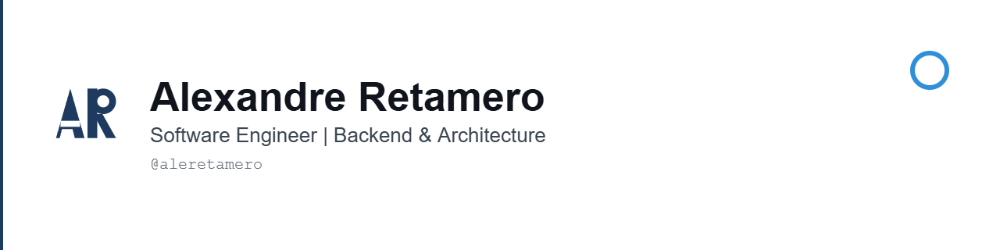
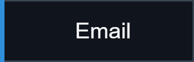

<picture>
  <source media="(prefers-color-scheme: dark)" srcset="./assets/github-header-dark-1280x320.png">
  
</picture>

  
  &nbsp;
  

▲ ── ◯ ── ▲

### About me

I'm a Software Engineer focused on backend development, software architecture, and distributed systems.

I build and evolve production systems primarily with Node.js, TypeScript, and NestJS, with additional professional experience using Python. I work across business-critical domains such as authentication, cashback, payments, notifications, KYC, betting, and asynchronous processing.

My work combines hands-on development with technical leadership: structuring ambiguous problems, documenting decisions, improving architecture, and helping teams build systems that are secure, observable, and easier to evolve.

▲ ── ◯ ── ▲

### Core expertise

**Backend** 

**Data** 

**Messaging** 

**Cloud & infrastructure** 

**Quality & observability** 

**Additional experience** 

**Applied architecture practices** 
My experience includes applying and contributing to Clean Architecture, DDD, CQRS, and Design Patterns when the domain and system complexity justify them.

▲ ── ◯ ── ▲

### What I care about

- Clear boundaries between domain, application, and infrastructure
- Pragmatic architecture that supports product evolution
- Reliable asynchronous flows, retries, and idempotency
- Security, traceability, and operational visibility
- Technical decisions documented with context and trade-offs
- Codebases that teams can understand and maintain

▲ ── ◯ ── ▲

### Current direction

I'm currently strengthening my public portfolio with backend case studies and projects that better represent my experience in architecture, messaging, observability, and cloud infrastructure.

New repositories will be published selectively. Each highlighted project should include tests, execution instructions, architecture decisions, and explicit trade-offs instead of being only a technology showcase.

▲ ── ◯ ── ▲

### Connect

  
  &nbsp;
  

